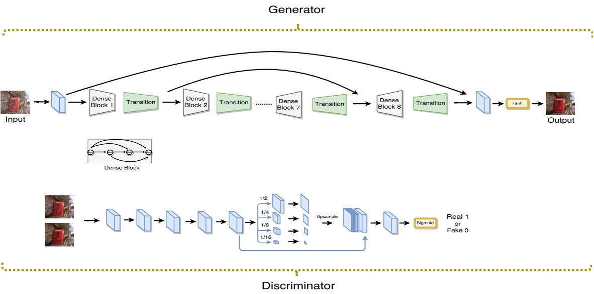

# ID-CGAN (TCSVT'2020)

<details>
<summary align="right"><a href="https://ieeexplore.ieee.org/document/8727938">Image De-Raining Using a Conditional Generative Adversarial Network (TCSVT'2020)</a></summary>

```bibtex
@article{zhang2019image,
  title={Image de-raining using a conditional generative adversarial network},
  author={Zhang, He and Sindagi, Vishwanath and Patel, Vishal M},
  journal={IEEE transactions on circuits and systems for video technology},
  volume={30},
  number={11},
  pages={3943--3956},
  year={2019},
  publisher={IEEE}
}
```

</details>

<br/>



<br/>

**Quantitative Result**

The metrics are `PSNR/SSIM`. Both are evaluated on RGB channels.

> **_NOTE:_**
>
> - The code was migrated directly from the authors' published code, except for changes of loss weights (see below).
> - The weight of GANLoss, MSELoss and perceptual loss is 1, 150, 150 respectively in the official code. It would make the training process unstable, so we adopt the weight in the paper, which is 6.6e-3, 1, 1 respectively.
> - Number of training epochs is reduced to 200 for Rain1200 and Rain1400.

|                  Method                   |  Rain200L   |  Rain200H   |   Rain800   |  Rain1200   |  Rain1400   |
| :---------------------------------------: | :---------: | :---------: | :---------: | :---------: | :---------: |
| [ID-CGAN](/configs/cgan/cgan_gc64dc48.py) | 33.61/0.964 | 22.54/0.806 | 23.79/0.820 | 26.77/0.822 | 28.27/0.877 |

<br/>

**Network Complexity**

|  Input shape  |    Flops    | Params |
| :-----------: | :---------: | :----: |
| (3, 256, 256) | 17.32GFlops | 1.98M  |
