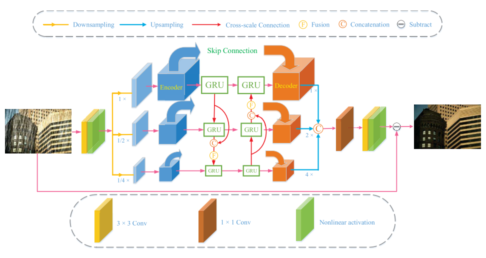

# DCSFN (ACMMM'2020)

<details>
<summary align="right"><a href="https://dl.acm.org/doi/abs/10.1145/3394171.3413820">DCSFN: Deep Cross-scale Fusion Network for Single Image Rain Removal</a></summary>

```bibtex
@inproceedings{wang2020dcsfn,
  title={DCSFN: deep cross-scale fusion network for single image rain removal},
  author={Wang, Cong and Xing, Xiaoying and Wu, Yutong and Su, Zhixun and Chen, Junyang},
  booktitle={Proceedings of the 28th ACM international conference on multimedia},
  pages={1643--1651},
  year={2020}
}
```

</details>

<br/>



<br/>

**Quantitative Result**

The metrics are `PSNR/SSIM`. Both are evaluated on RGB channels.

> **_NOTE:_**
>
> - Following the authors' setup, random seed is set to 66 in all experiments.
> - Number of training epochs is reduced to 80 for Rain1200 and Rain1400.

|                        Method                        |  Rain200L   |  Rain200H   |   Rain800   |  Rain1200   |  Rain1400   |
| :--------------------------------------------------: | :---------: | :---------: | :---------: | :---------: | :---------: |
|  [DCSFN(GRU)](/configs/dcsfn/dcsfn_c20s4l16_gru.py)  | 37.73/0.983 | 28.28/0.895 | 26.49/0.855 | 31.66/0.914 | 30.38/0.912 |
| [DCSFN(LSTM)](/configs/dcsfn/dcsfn_c20s4l16_lstm.py) | 37.66/0.984 | 27.93/0.897 | 26.21/0.855 | 31.55/0.913 | 30.42/0.915 |
|  [DCSFN(RNN)](/configs/dcsfn/dcsfn_c20s4l16_rnn.py)  | 37.15/0.982 | 27.39/0.893 | 25.12/0.847 | 31.56/0.913 | 28.95/0.907 |

<br/>

**Network Complexity**

|   Method    |  Input shape  |    Flops    | Params |
| :---------: | :-----------: | :---------: | :----: |
| DCSFN(GRU)  | (3, 250, 250) | 70.69GFlops | 6.45M  |
| DCSFN(LSTM) | (3, 250, 250) | 71.69GFlops | 6.50M  |
| DCSFN(RNN)  | (3, 250, 250) | 69.04GFlops | 6.37M  |
