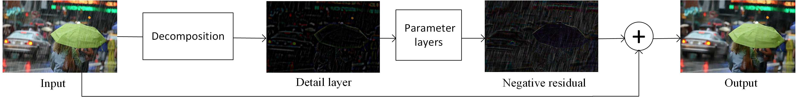

# DDN (CVPR'2017)

<details>
<summary align="right"><a href="https://openaccess.thecvf.com/content_cvpr_2017/html/Fu_Removing_Rain_From_CVPR_2017_paper.html">Removing Rain From Single Images via a Deep Detail Network (CVPR'2017)</a></summary>

```bibtex
@inproceedings{fu2017removing,
  title={Removing rain from single images via a deep detail network},
  author={Fu, Xueyang and Huang, Jiabin and Zeng, Delu and Huang, Yue and Ding, Xinghao and Paisley, John},
  booktitle={Proceedings of the IEEE Conference on Computer Vision and Pattern Recognition},
  pages={3855--3863},
  year={2017}
}
```

</details>

<br/>



<br/>

**Quantitative Result**

The metrics are `PSNR/SSIM`. Both are evaluated on RGB channels.

|                  Method                  |  Rain200L   |  Rain200H   |   Rain800   |  Rain1200   |  Rain1400   |
| :--------------------------------------: | :---------: | :---------: | :---------: | :---------: | :---------: |
| [ddn_c16d26](/configs/ddn/ddn_c16d26.py) | 32.86/0.947 | 23.99/0.739 | 24.02/0.789 | 29.00/0.850 | 28.67/0.868 |

<br/>

**Network Complexity**

|  Input shape  |   Flops    | Params |
| :-----------: | :--------: | :----: |
| (3, 256, 256) | 3.79GFlops | 57.73k |
