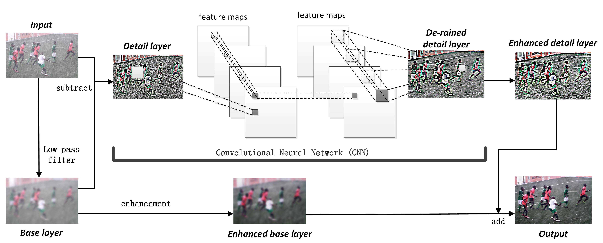

# DerainNet (TIP'2017)

<details>
<summary align="right"><a href="https://ieeexplore.ieee.org/abstract/document/7893758/">Clearing the Skies: A Deep Network Architecture for Single-Image Rain Removal (TIP'2017)</a></summary>

```bibtex
@article{fu2017clearing,
  title={Clearing the skies: A deep network architecture for single-image rain removal},
  author={Fu, Xueyang and Huang, Jiabin and Ding, Xinghao and Liao, Yinghao and Paisley, John},
  journal={IEEE Transactions on Image Processing},
  volume={26},
  number={6},
  pages={2944--2956},
  year={2017},
  publisher={IEEE}
}
```

</details>

<br/>



<br/>

**Quantitative Result**

The metrics are `PSNR/SSIM`. Both are evaluated on RGB channels.

|                         Method                         |  Rain200L   |  Rain200H   |   Rain800   |  Rain1200   |  Rain1400   |
| :----------------------------------------------------: | :---------: | :---------: | :---------: | :---------: | :---------: |
| [derainnet_c512](/configs/derainnet/derainnet_c512.py) | 32.25/0.945 | 23.12/0.735 | 23.25/0.783 | 28.28/0.846 | 27.53/0.866 |

<br/>

**Network Complexity**

|  Input shape  |    Flops    | Params  |
| :-----------: | :---------: | :-----: |
| (3, 256, 256) | 51.48GFlops | 754.69k |
