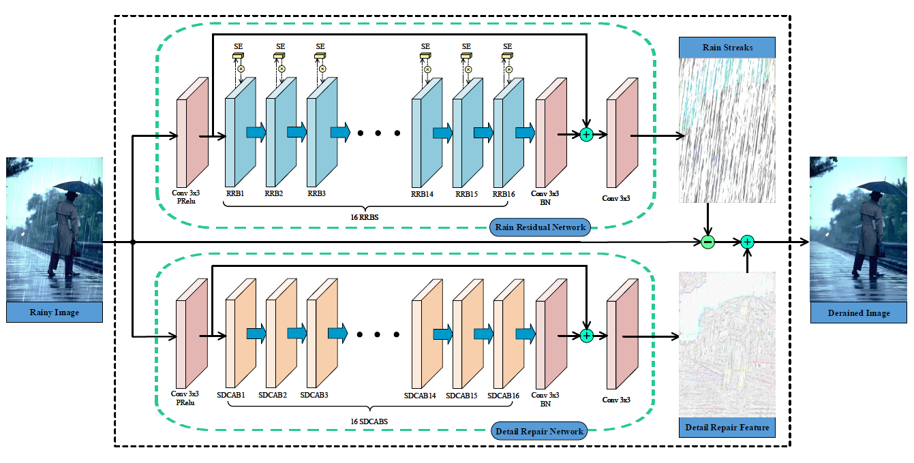

# DRD-Net (CVPR'2020)

<details>
<summary align="right"><a href="https://openaccess.thecvf.com/content_CVPR_2020/html/Deng_Detail-recovery_Image_Deraining_via_Context_Aggregation_Networks_CVPR_2020_paper.html">Detail-recovery Image Deraining via Context Aggregation Networks (CVPR'2020)</a></summary>

```bibtex
@inproceedings{deng2020detail,
  title={Detail-recovery image deraining via context aggregation networks},
  author={Deng, Sen and Wei, Mingqiang and Wang, Jun and Feng, Yidan and Liang, Luming and Xie, Haoran and Wang, Fu Lee and Wang, Meng},
  booktitle={Proceedings of the IEEE/CVF conference on computer vision and pattern recognition},
  pages={14560--14569},
  year={2020}
}
```

</details>

<br/>



<br/>

**Quantitative Result**

The metrics are `PSNR/SSIM`. Both are evaluated on RGB channels.

> **_Note:_**  
> 1. The test result is much lower to the one reported in the paper. A similar issue is reported in https://github.com/Dengsgithub/DRD-Net/issues/8.
> 2. A major difference between the official code and the code in this repo is that: the official code uses sum of rain image $O$ and rain estimation $\hat{R}$ as the input of background recovery subnet, while this repo uses a single rain image $O$ as the input, which is consistent with the paper. Experiments show that the latter one has a better performance.

|                   Method                    |  Rain200L   |  Rain200H   |   Rain800   |  Rain1200   |  Rain1400   |
| :-----------------------------------------: | :---------: | :---------: | :---------: | :---------: | :---------: |
| [DRD-Net](/configs/drdnet/drdnet_c64d16.py) | 32.96/0.963 | 23.01/0.726 | 23.33/0.788 | 26.25/0.814 | 26.66/0.841 |

<br/>

**Network Complexity**

|  Input shape  |    Flops     | Params |
| :-----------: | :----------: | :----: |
| (3, 256, 256) | 522.54GFlops | 7.98M  |
