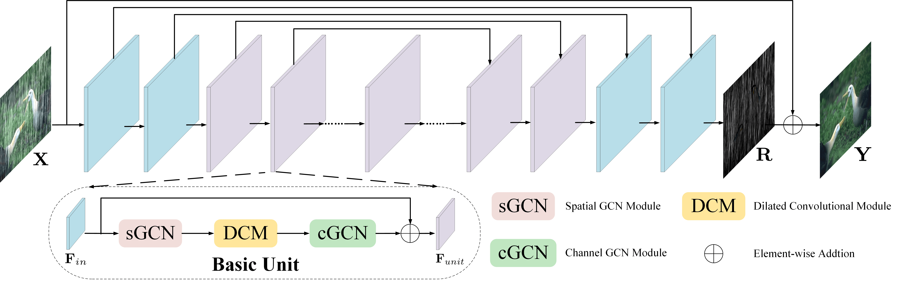

# DualGCN (AAAI'2021)

<details>
<summary align="right"><a href="https://ojs.aaai.org/index.php/AAAI/article/view/16224">Rain Streak Removal via Dual Graph Convolutional Network</a></summary>

```bibtex
@inproceedings{fu2021rain,
  title={Rain streak removal via dual graph convolutional network},
  author={Fu, Xueyang and Qi, Qi and Zha, Zheng-Jun and Zhu, Yurui and Ding, Xinghao},
  booktitle={Proc. AAAI Conf. Artif. Intell.},
  pages={1--9},
  year={2021}
}
```

</details>

<br/>



<br/>

**Quantitative Result**

The metrics are `PSNR/SSIM`. Both are evaluated on RGB channels.

|                         Method                          |  Rain200L   |  Rain200H   |   Rain800   |  Rain1200   |  Rain1400   |
| :-----------------------------------------------------: | :---------: | :---------: | :---------: | :---------: | :---------: |
| [dual_gcn_c72n11](/configs/dual_gcn/dual_gcn_c72n11.py) | 36.84/0.979 | 27.07/0.860 | 23.68/0.799 | 32.44/0.912 | 31.42/0.920 |

<br/>

**Network Complexity**

|  Input shape  |    Flops     | Params  |
| :-----------: | :----------: | :-----: |
| (3, 256, 256) | 177.78GFlops | 845.82k |