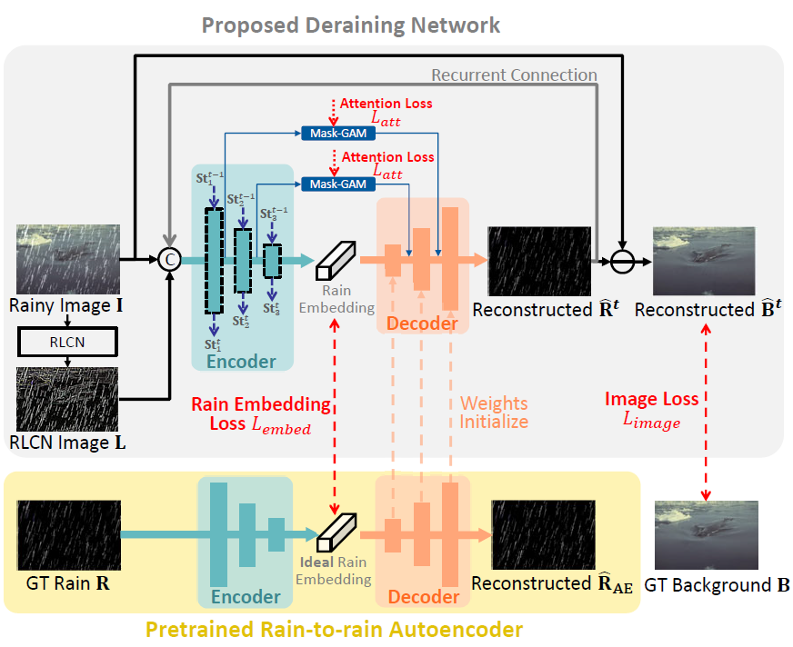

# ECNet (WACV'2022)

<details>
<summary align="right"><a href="https://openaccess.thecvf.com/content/WACV2022/html/Li_Single_Image_Deraining_Network_With_Rain_Embedding_Consistency_and_Layered_WACV_2022_paper.html">Single Image Deraining Network With Rain Embedding Consistency and Layered LSTM (WACV'2022)</a></summary>

```bibtex
@inproceedings{li2022single,
  title={Single Image Deraining Network with Rain Embedding Consistency and Layered LSTM},
  author={Li, Yizhou and Monno, Yusuke and Okutomi, Masatoshi},
  booktitle={Proceedings of the IEEE/CVF Winter Conference on Applications of Computer Vision},
  pages={4060--4069},
  year={2022}
}
```

</details>

<br/>



<br/>

**Quantitative Result**

The metrics are `PSNR/SSIM`. Both are evaluated on RGB channels.

> **_NOTE:_**
>
> - The training is in two stages:
>   - stage1: train the rain-to-rain autoencoder.
>   - stage2: fix the autoencoder and train ecnet.
> - Images are denormalized before evaluation.
> - The performance of the model is not stable during the training. Thus, the reported performance is not from the last checkpoint. Instead, it is the best performance of all validations during training.

|                        Method                         |  Rain200L   |  Rain200H   |   Rain800   |  Rain1200   |  Rain1400   |
| :---------------------------------------------------: | :---------: | :---------: | :---------: | :---------: | :---------: |
|     [ECNet](/configs/ecnet/ecnet_stage2_c32d4.py)     | 36.75/0.979 | 26.94/0.866 | 26.66/0.866 | 31.68/0.911 | 30.83/0.918 |
| [ECNet+LL](/configs/ecnet/ecnet_stage2_c32d4r6_ll.py) | 37.67/0.982 | 27.70/0.882 | 26.13/0.852 | 31.42/0.899 | 31.00/0.918 |

<br/>

**Network Complexity**

|      Model       |  Input shape  |    Flops     | Params |
| :--------------: | :-----------: | :----------: | :----: |
| Rain Autoencoder | (3, 256, 256) | 11.65GFlops  | 2.03M  |
|      ECNet       | (3, 256, 256) | 15.86GFlops  | 2.46M  |
|     ECNet+LL     | (3, 256, 256) | 211.57GFlops | 8.73M  |
