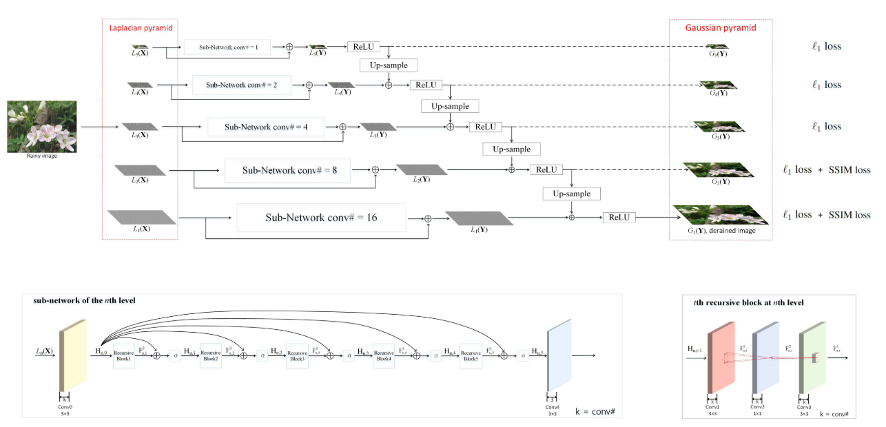

# LPNet (TNNLS'2019)

<details>
<summary align="right"><a href="https://ieeexplore.ieee.org/document/8767931">Lightweight Pyramid Networks for Image Deraining (TNNLS'2019)</a></summary>

```bibtex
@article{fu2019lightweight,
  title={Lightweight pyramid networks for image deraining},
  author={Fu, Xueyang and Liang, Borong and Huang, Yue and Ding, Xinghao and Paisley, John},
  journal={IEEE transactions on neural networks and learning systems},
  volume={31},
  number={6},
  pages={1794--1807},
  year={2019},
  publisher={IEEE}
}
```

</details>

<br/>



<br/>

**Quantitative Result**

The metrics are `PSNR/SSIM`. Both are evaluated on RGB channels.

|                      Method                      |  Rain200L   |  Rain200H   |   Rain800   |  Rain1200   |  Rain1400   |
| :----------------------------------------------: | :---------: | :---------: | :---------: | :---------: | :---------: |
| [lpnet_c16d5r5](/configs/lpnet/lpnet_c16d5r5.py) | 32.12/0.955 | 21.96/0.785 | 22.81/0.820 | 27.74/0.862 | 28.30/0.884 |

<br/>

**Network Complexity**

|  Input shape  |   Flops    | Params |
| :-----------: | :--------: | :----: |
| (3, 256, 256) | 1.77GFlops | 7.55k  |
