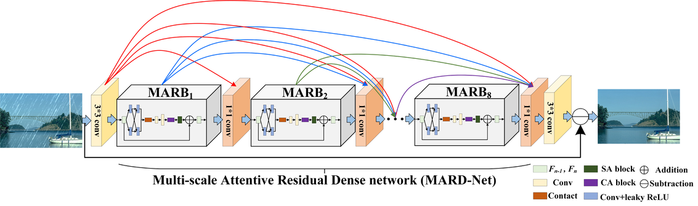

# MARDNet (ACCV'2020)

<details>
<summary align="right"><a href="https://openaccess.thecvf.com/content/ACCV2020/html/Chen_Multi-scale_Attentive_Residual_Dense_Network_for_Single_Image_Rain_Removal_ACCV_2020_paper.html">Multi-scale Attentive Residual Dense Network for Single Image Rain Removal (ACCV'2020)</a></summary>

```bibtex
@inproceedings{chen2020multi,
  title={Multi-scale Attentive Residual Dense Network for Single Image Rain Removal},
  author={Chen, Xiang and Huang, Yufeng and Xu, Lei},
  booktitle={Proceedings of the Asian Conference on Computer Vision},
  year={2020}
}
```

</details>

<br/>



<br/>

**Quantitative Result**

The metrics are `PSNR/SSIM`. Both are evaluated on RGB channels.

|                       Method                       |  Rain200L   |  Rain200H   |   Rain800   |  Rain1200   |  Rain1400   |
| :------------------------------------------------: | :---------: | :---------: | :---------: | :---------: | :---------: |
| [mard_c32g32n8](/configs/mardnet/mard_c32g32n8.py) | 35.51/0.975 | 25.98/0.853 | 24.36/0.841 | 32.48/0.915 | 31.03/0.918 |

<br/>

**Network Complexity**

|  Input shape  |    Flops    | Params  |
| :-----------: | :---------: | :-----: |
| (3, 256, 256) | 47.26GFlops | 723.81k |
