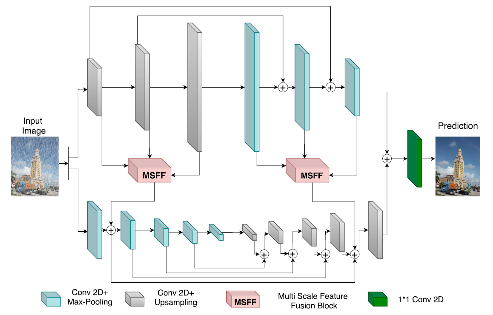

# OUCDNet (JSTSP'2020)

<details>
<summary align="right"><a href="https://ieeexplore.ieee.org/abstract/document/9264746">Exploring Overcomplete Representations for Single Image Deraining Using CNNs (JSTSP'2020)</a></summary>

```bibtex
@article{yasarla2020exploring,
  title={Exploring overcomplete representations for single image deraining using cnns},
  author={Yasarla, Rajeev and Valanarasu, Jeya Maria Jose and Patel, Vishal M},
  journal={IEEE Journal of Selected Topics in Signal Processing},
  volume={15},
  number={2},
  pages={229--239},
  year={2020},
  publisher={IEEE}
}
```

</details>

<br/>



<br/>

**Quantitative Result**

> **_Note:_**
> - Results on Rain800, Rain1200 and Rain1400 are not reported due to insufficient memory (evaluation is performed on a single RTX 3090 GPU).


The metrics are `PSNR/SSIM`. Both are evaluated on RGB channels.

|                           Method                           |  Rain200L   |  Rain200H   |   Rain800   |  Rain1200   |  Rain1400   |
| :--------------------------------------------------------: | :---------: | :---------: | :---------: | :---------: | :---------: |
| [oucdnet_o3n5_msff](/configs/oucdnet/oucdnet_o3n5_msff.py) | 34.01/0.962 | 23.71/0.803 | -----/----- | -----/----- | -----/----- |

<br/>

**Network Complexity**

|  Input shape  |    Flops     | Params |
| :-----------: | :----------: | :----: |
| (3, 256, 256) | 438.55GFlops | 11.01M |

