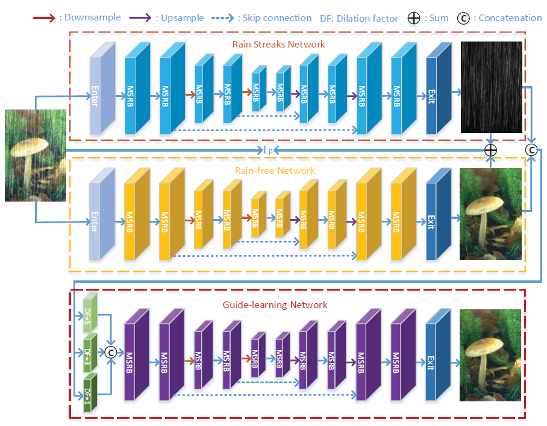

# Physical Model Guided ID (ICME'2020)

<details>
<summary align="right"><a href="https://www.computer.org/csdl/proceedings-article/icme/2020/09102878/1kwr8NheVtm">Physical Model Guided Deep Image Deraining (ICME'2020)</a></summary>

```bibtex
@inproceedings{zhu2020physical,
  title={Physical model guided deep image deraining},
  author={Zhu, Honghe and Wang, Cong and Zhang, Yajie and Su, Zhixun and Zhao, Guohui},
  booktitle={2020 IEEE International Conference on Multimedia and Expo (ICME)},
  pages={1--6},
  year={2020},
  organization={IEEE}
}
```

</details>

<br/>



<br/>

**Quantitative Result**

The metrics are `PSNR/SSIM`. Both are evaluated on RGB channels.

> **_NOTE:_**
>
> - Following the authors' setup, random seed is set to 66 in all experiments.
> - Due to limited computation resource and limited time:
>   - batch size is reduced from 32 to 4
>   - patch size is reduced from 160\*160 to 128\*218
>   - training epochs is reduced from 2000 to 200

|                            Method                            |  Rain200L   |  Rain200H   |   Rain800   |  Rain1200   |  Rain1400   |
| :----------------------------------------------------------: | :---------: | :---------: | :---------: | :---------: | :---------: |
| [pmg_c64d5s3](/configs/physical_model_guided/pmg_c64d5s3.py) | 36.93/0.979 | 28.04/0.878 | 26.15/0.854 | 33.10/0.922 | 31.39/0.919 |

<br/>

**Network Complexity**

|  Input shape  |    Flops    | Params |
| :-----------: | :---------: | :----: |
| (3, 256, 256) | 98.38GFlops | 2.77M  |
