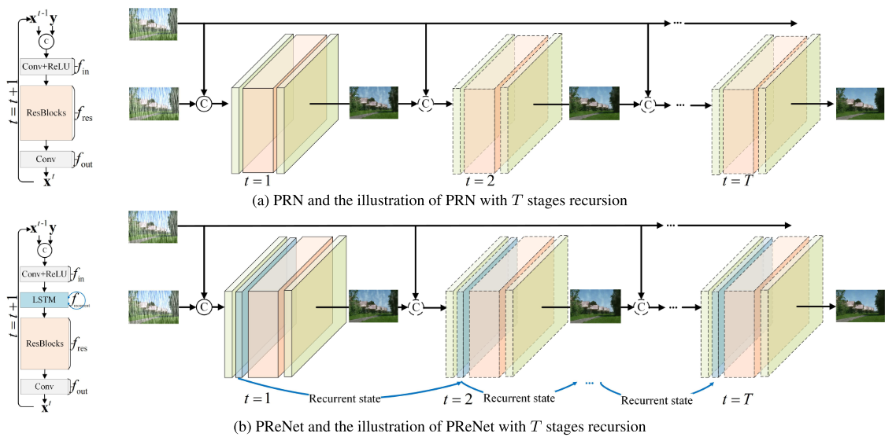

# PReNet (CVPR'2019)

<details>
<summary align="right"><a href="https://openaccess.thecvf.com/content_CVPR_2019/html/Ren_Progressive_Image_Deraining_Networks_A_Better_and_Simpler_Baseline_CVPR_2019_paper.html">Progressive Image Deraining Networks: A Better and Simpler Baseline (CVPR'2019)</a></summary>

```bibtex
@inproceedings{ren2019progressive,
  title={Progressive image deraining networks: A better and simpler baseline},
  author={Ren, Dongwei and Zuo, Wangmeng and Hu, Qinghua and Zhu, Pengfei and Meng, Deyu},
  booktitle={Proceedings of the IEEE/CVF Conference on Computer Vision and Pattern Recognition},
  pages={3937--3946},
  year={2019}
}
```

</details>

<br/>



<br/>

**Quantitative Result**

The metrics are `PSNR/SSIM`. Both are evaluated on RGB channels.

> **_NOTE:_**
>
> - Stride of patch sampling is set to 80 for Rain200L, Rain200H, Rain800, and 100 for Rain1200, Rain1400
> - Number of training epochs is reduced to 10 for Rain1200 and Rain1400.

|                          Method                           |  Rain200L   |  Rain200H   |   Rain800   |  Rain1200   |  Rain1400   |
| :-------------------------------------------------------: | :---------: | :---------: | :---------: | :---------: | :---------: |
|           [prn](/configs/prenet/prn_c32s6d5.py)           | 36.19/0.979 | 26.97/0.877 | 24.59/0.848 | 31.45/0.908 | 29.74/0.909 |
|    [prenet_gru](/configs/prenet/prenet_c32s6d5_gru.py)    | 36.72/0.981 | 27.93/0.890 | 25.07/0.850 | 31.88/0.912 | 30.30/0.913 |
|   [prenet_lstm](/configs/prenet/prenet_c32s6d5_lstm.py)   | 36.92/0.981 | 28.01/0.891 | 25.18/0.850 | 31.91/0.912 | 30.21/0.913 |
|         [prn_r](/configs/prenet/prn_c32s6d5_r.py)         | 34.79/0.973 | 25.98/0.859 | 24.21/0.842 | 30.56/0.899 | 29.12/0.901 |
|  [prenet_gru_r](/configs/prenet/prenet_c32s6d5_gru_r.py)  | 36.19/0.978 | 27.16/0.877 | 24.77/0.848 | 31.52/0.907 | 29.96/0.910 |
| [prenet_lstm_r](/configs/prenet/prenet_c32s6d5_lstm_r.py) | 36.20/0.979 | 27.31/0.880 | 24.89/0.852 | 31.53/0.908 | 29.98/0.911 |

<br/>

**Network Complexity**

|     Method     |  Input shape  |    Flops    | Params  |
| :------------: | :-----------: | :---------: | :-----: |
|      PRN       | (3, 250, 250) | 35.79GFlops | 95.11k  |
|     PRN_r      | (3, 250, 250) | 35.79GFlops | 21.12k  |
|  PReNet(GRU)   | (3, 250, 250) | 56.56GFlops | 150.50k |
| PReNet_r(GRU)  | (3, 250, 250) | 56.56GFlops | 76.52k  |
|  PReNet(LSTM)  | (3, 250, 250) | 63.48GFlops | 168.96k |
| PReNet_r(LSTM) | (3, 250, 250) | 63.48GFlops | 94.98k  |
