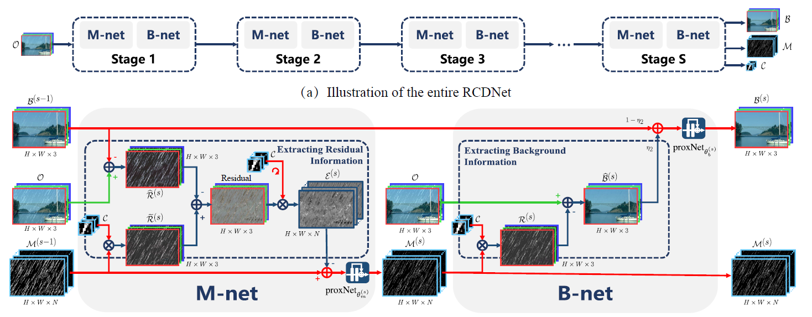

# RCDNet (CVPR'2020)

<details>
<summary align="right"><a href="https://openaccess.thecvf.com/content_CVPR_2020/html/Wang_A_Model-Driven_Deep_Neural_Network_for_Single_Image_Rain_Removal_CVPR_2020_paper.html">A Model-Driven Deep Neural Network for Single Image Rain Removal (CVPR'2020)</a></summary>

```bibtex
@inproceedings{wang2020model,
  title={A model-driven deep neural network for single image rain removal},
  author={Wang, Hong and Xie, Qi and Zhao, Qian and Meng, Deyu},
  booktitle={Proceedings of the IEEE/CVF Conference on Computer Vision and Pattern Recognition},
  pages={3103--3112},
  year={2020}
}
```

</details>

<br/>



<br/>

**Quantitative Result**

The metrics are `PSNR/SSIM`. Both are evaluated on RGB channels.

|                        Method                         |  Rain200L   |  Rain200H   |   Rain800   |  Rain1200   |  Rain1400   |
| :---------------------------------------------------: | :---------: | :---------: | :---------: | :---------: | :---------: |
| [rcdnet_c32s17n4](/configs/rcdnet/rcdnet_c32s17n4.py) | 39.14/0.986 | 29.43/0.900 | 27.75/0.872 | 32.62/0.917 | 31.28/0.919 |

<br/>

**Network Complexity**

|  Input shape  |    Flops     | Params |
| :-----------: | :----------: | :----: |
| (3, 256, 256) | 194.54GFlops | 2.97M  |

> **Help Wanted**: The results obtained from `test.py` deviates from the true value. It is speculated that the network weights has not been saved correctly. The experimental results given above are from the evaluation process of the last epoch (by checking log files). The evaluation process, which is called from `EvalHook`, differs from the testing process of `test.py` in that it loads the network weights in memory directly, without going through the serialization process.
