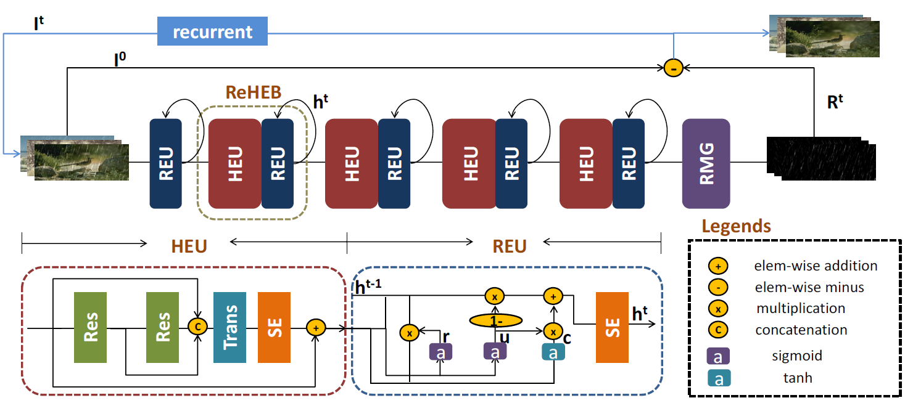

# ReHEN (ACMMM'2019)

<details>
<summary align="right"><a href="https://dl.acm.org/doi/10.1145/3343031.3351149">Single Image Deraining via Recurrent Hierarchy Enhancement Network (ACMMM'2019)</a></summary>

```bibtex
@inproceedings{yang2019single,
  title={Single image deraining via recurrent hierarchy enhancement network},
  author={Yang, Youzhao and Lu, Hong},
  booktitle={Proceedings of the 27th ACM International Conference on Multimedia},
  pages={1814--1822},
  year={2019}
}
```

</details>

<br/>



<br/>

**Quantitative Result**

The metrics are `PSNR/SSIM`. Both are evaluated on RGB channels.

|                      Method                      |  Rain200L   |  Rain200H   |   Rain800   |  Rain1200   |  Rain1400   |
| :----------------------------------------------: | :---------: | :---------: | :---------: | :---------: | :---------: |
| [rehen_c24s4n5](/configs/rehen/rehen_c24s4n5.py) | 38.06/0.983 | 27.76/0.868 | 26.83/0.849 | 32.28/0.907 | 31.22/0.914 |

<br/>

**Network Complexity**

|  Input shape  |    Flops    | Params  |
| :-----------: | :---------: | :-----: |
| (3, 256, 256) | 71.05GFlops | 297.96k |
