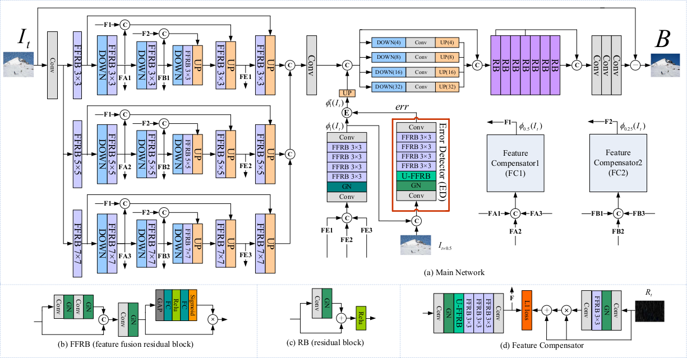

# RLNet (CVPR'2021)

<details>
<summary align="right"><a href="https://openaccess.thecvf.com/content/CVPR2021/html/Chen_Robust_Representation_Learning_With_Feedback_for_Single_Image_Deraining_CVPR_2021_paper.html">Robust Representation Learning With Feedback for Single Image Deraining (CVPR'2021)</a></summary>

```bibtex
@inproceedings{chen2021robust,
  title={Robust representation learning with feedback for single image deraining},
  author={Chen, Chenghao and Li, Hao},
  booktitle={Proceedings of the IEEE/CVF Conference on Computer Vision and Pattern Recognition},
  pages={7742--7751},
  year={2021}
}
```

</details>

<br/>



<br/>

**Quantitative Result**

The metrics are `PSNR/SSIM`. Both are evaluated on RGB channels.

> **_NOTE:_**
>
> - Number of training epochs is reduced to 24 for Rain1200 and Rain1400.
> - The official code and the paper are somehow inconsistent:
> 
>    | Paper                                                                                                                                                                                                     | Official Code                                                                                                                                                                                           |
>    |:--------------------------------------------------------------------------------------------------------------------------------------------------------------------------------------------------------- |:------------------------------------------------------------------------------------------------------------------------------------------------------------------------------------------------------- |
>    | Train in two stages                                                                                                                                                                                       | End-to-end training                                                                                                                                                                                     |
>   | Batch size is 1                                                                                                                                                                                         | Batch size is 2                                                                                                                                                                                         |
>   | Training epochs: 90 + 240                                                                                                                                                                               | Training epochs: 242                                                                                                                                                                                    |
>    |                                                                                                 |                                                                                               |
>    |                                                                                                 |                                                                                               |
>    |                 |               |
>    |  |  |
> - Three sciripts are provided for reproducing this work: [rlnet_official_code.py](./rlnet_official_code.py) is directly migrated from the official code, while [rlnet_stage1.py](./rlnet_stage1.py) and [rlnet_stage2.py](./rlnet_stage2.py) follows the settings in the paper.


|                            Method                             |  Rain200L   |  Rain200H   |   Rain800   |  Rain1200   |  Rain1400   |
| :-----------------------------------------------------------: | :---------: | :---------: | :---------: | :---------: | :---------: |
| [RLNet(official code)](/configs/rlnet/rlnet_official_code.py) | 36.56/0.978 | 27.67/0.874 | 27.19/0.866 | 32.37/0.914 | 30.72/0.916 |
|        [RLNet(paper)](/configs/rlnet/rlnet_stage2.py)         | -----/----- | -----/----- | -----/----- | -----/----- | -----/----- |

<br/>

**Network Complexity**

|  Input shape  |    Flops    | Params |
| :-----------: | :---------: | :----: |
| (3, 256, 256) | 68.94GFlops | 5.82M  |
