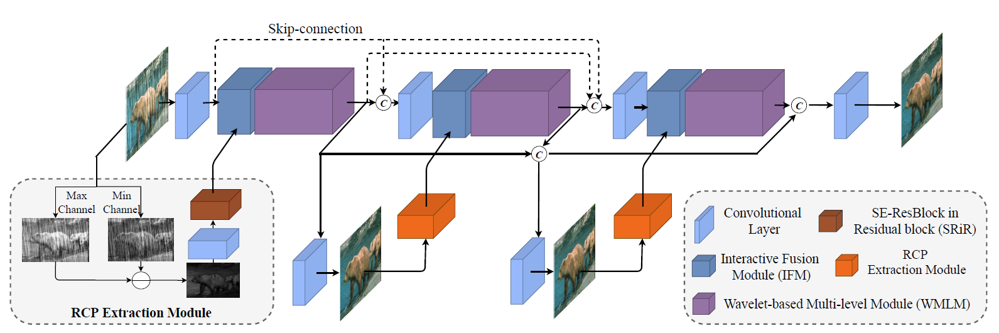

# SPDNet (ICCV'2021)

<details>
<summary align="right"><a href="https://openaccess.thecvf.com/content/ICCV2021/html/Yi_Structure-Preserving_Deraining_With_Residue_Channel_Prior_Guidance_ICCV_2021_paper.html">Structure-Preserving Deraining with Residue Channel Prior Guidance (ICCV'2021)</a></summary>

```bibtex
@inproceedings{yi2021structure,
  title={Structure-Preserving Deraining with Residue Channel Prior Guidance},
  author={Yi, Qiaosi and Li, Juncheng and Dai, Qinyan and Fang, Faming and Zhang, Guixu and Zeng, Tieyong},
  booktitle={Proceedings of the IEEE/CVF International Conference on Computer Vision},
  pages={4238--4247},
  year={2021}
}
```

</details>

<br/>



<br/>

**Quantitative Result**

The metrics are `PSNR/SSIM`. Both are evaluated on RGB channels.

> **_NOTE:_**
>
> - The offical implementation repeated the training set for several times, which is calculated by:
> 
>    times = max(1, 1000//num_of_batches)
>
> - To reproduce the experiment, please set the `times` argument in the config accordingly
> - Result on Rain200L is not reported since the performance of the model is not stable during training. The exact causes are not yet clear.

|                       Method                       |  Rain200L   |  Rain200H   |   Rain800   |  Rain1200   |  Rain1400   |
| :------------------------------------------------: | :---------: | :---------: | :---------: | :---------: | :---------: |
| [SPDNet](/configs/spdnet/spdnet_c32s3_l3ns3nr3.py) | -----/----- | 29.19/0.896 | 28.43/0.872 | 32.64/0.912 | 31.43/0.917 |

<br/>

**Network Complexity**

|  Input shape  |    Flops    | Params |
| :-----------: | :---------: | :----: |
| (3, 256, 256) | 89.94GFlops | 2.98M  |
